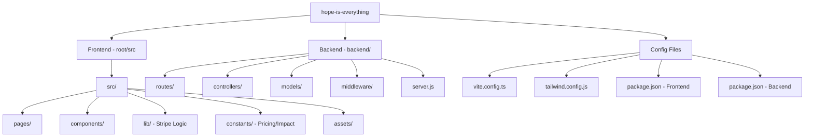
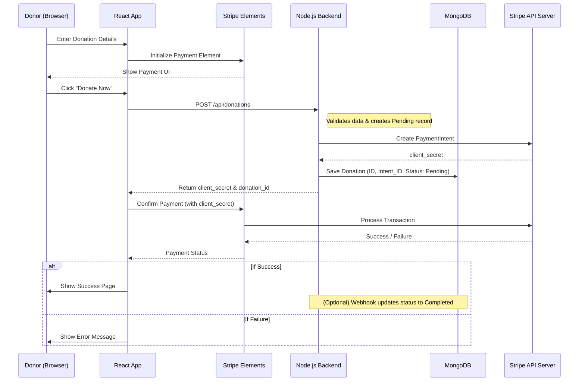

# Project Architecture & Flow

> [!TIP]
> This is a high-level visual representation. For an interactive view, open [project_map.html](file:///c:/Users/JOEX7/Desktop/Programfile/donation/hope-is-everything/project_map.html) in your browser.

## 1. Folder Structure Diagram

The project is split into a **Vite/React Frontend** and a **Node.js/Express Backend**.

## 2. Donation Flow Diagram

This diagram shows how a donation request moves through the system.

## 3. Component Responsibilities

| Directory | Responsibility |
| :--- | :--- |
| `src/pages` | Main application views (Home, Donate, About, etc.) |
| `src/components` | Reusable UI elements (Header, Footer, Calculator) |
| `src/lib` | External service integrations (Stripe, API clients) |
| `backend/models` | Database schemas (User, Donation) |
| `backend/controllers` | Business logic for processing requests |
| `backend/routes` | API endpoint definitions |
